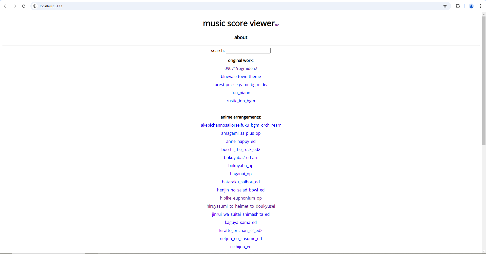

## music-score-viewer    
    
    
    
    
    
This application serves as a way for me to share my music scores I've created with MuseScore. It syncs instrument part playback with pdf music scores (based on data I set in a .json file).    
    
I was inspired to make this after reaching my free limit on MuseScore and wanted a way to continue sharing my work. Although this isn't as nice as what MuseScore offers, I think it's an interesting substitute. One neat feature is that you can change the volume and panning of individual instrument parts. However, there is no score highlighting and the user (i.e. me) is responsible for providing the audio data for whatever instrument parts they want to display, as well as determining when the score pages should be turned.    
    
If, on initial page load the audio sounds out of sync, stopping and replaying should help.    
    
### notes:    
- in /src I have a json file that will be used to figure out the contents of score list in the sidebar menu.
- all the scores are in /music. each score has its own folder and in each folder is a json file. this file contains the information to know what instrument sliders need to be created, where the score file is, etc.
    
### main dependencies:    
pdf.js (https://mozilla.github.io/pdf.js/)    
React   
    
### running locally:    
Run `npm install` to get the dependencies (super annoying, I know. sorry!)    
Then run `npm run dev` from this directory and go to `http://localhost:5173/`.    
